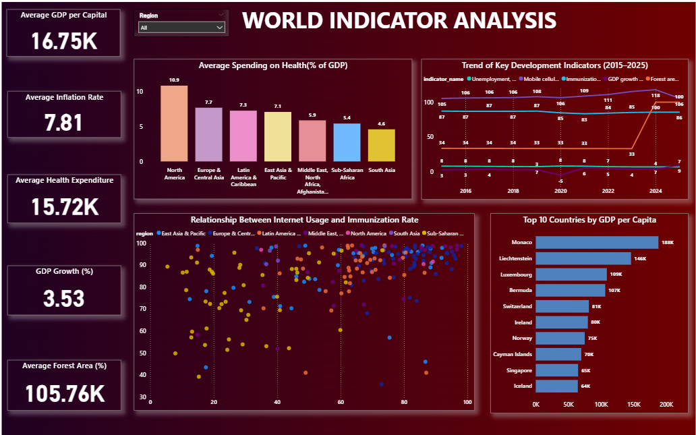
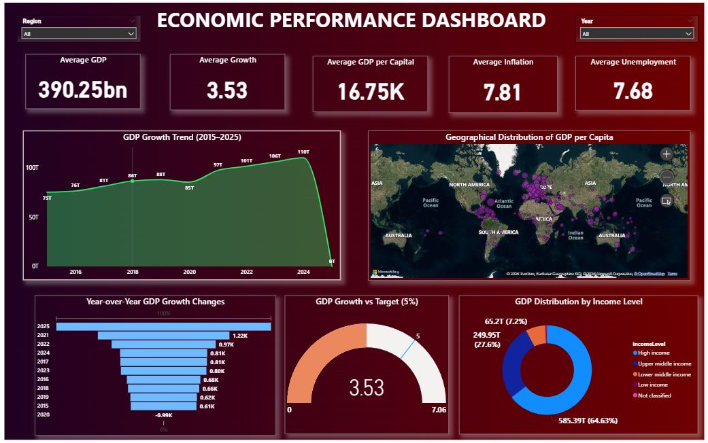
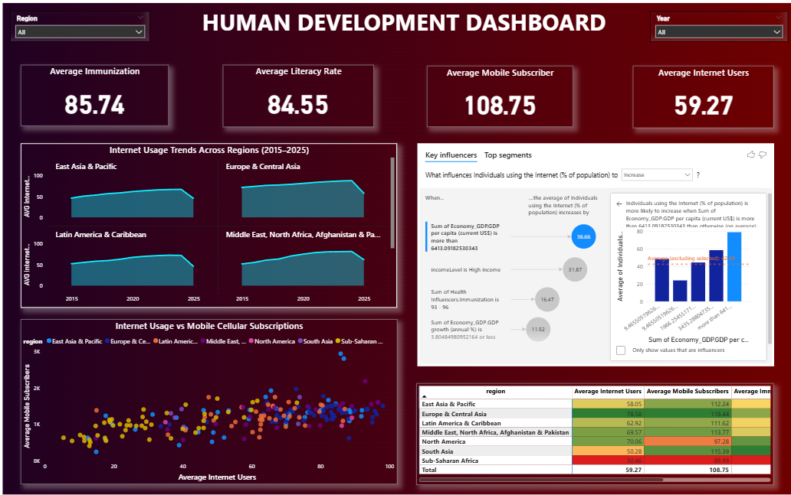
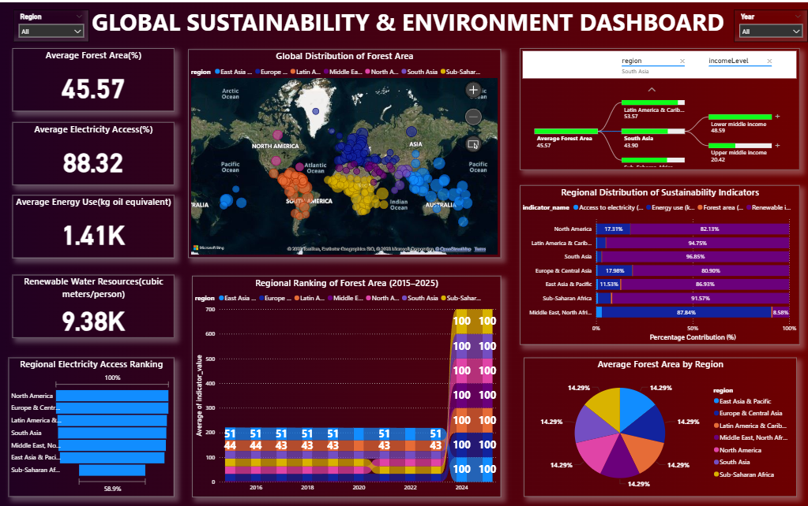

# 🌍 World Bank Global Development Dashboard

<p align="center">
  
</p>

An end-to-end **Power BI analytics project** that collects data from the **World Bank Open Data API**, processes it using **Python (Pandas)**, transforms and models it in **Power BI**, and presents interactive dashboards for analyzing global development trends across **Economy, Human Development, Population, Technology, and Sustainability**.

---

# 📌 Project Workflow

```text
World Bank API
      │
      ▼
Python (Requests + Pandas)
      │
      ▼
Data Cleaning & Preprocessing
      │
      ▼
CSV Generation
      │
      ▼
Power Query (ETL)
      │
      ▼
Data Modeling
      │
      ▼
DAX Measures
      │
      ▼
Interactive Power BI Dashboard
```

---

# 📊 Dashboard Preview

## 🏠 Executive Overview

<p align="center">

</p>

---

## 💰 Economic Performance Dashboard

<p align="center">

</p>

---

## 👨‍👩‍👧 Human Development Dashboard

<p align="center">

</p>

---

## 🌱 Sustainability & Environment Dashboard

<p align="center">

</p>

---

# 🚀 Key Features

- 🌍 Data collected from the **World Bank Open Data API**
- 🐍 Automated data extraction using **Python**
- 🧹 Data cleaning and preprocessing using **Pandas**
- 🔄 ETL pipeline implemented with **Power Query**
- 🔗 Data modeling using relationships between multiple datasets
- 📈 Custom DAX measures and KPI calculations
- 📊 Multi-page interactive dashboard
- 🌎 Geographic analysis using Maps
- 📉 Trend analysis across multiple years
- 🎯 Dynamic slicers and cross-filtering
- 🔍 Key Influencers & Decomposition Tree
- 📌 Ribbon, Scatter, Waterfall, Funnel, Gauge & Matrix visuals

---

# 🏗 Data Modeling

The dashboard integrates multiple subject-specific datasets into a unified analytical model.

### Tables

- Economy
- Education
- Health
- Population
- Technology
- Environment

### Relationships

The tables are modeled using common dimensions such as:

- Country
- Region
- Income Level
- Year

This enables cross-filtering and interactive analysis across multiple domains.

---

# 🛠 Tech Stack

| Technology | Purpose |
|------------|----------|
| Power BI Desktop | Dashboard Development |
| Power Query | ETL & Data Transformation |
| DAX | KPIs & Calculated Measures |
| Python | Data Extraction |
| Pandas | Data Cleaning |
| Requests | API Integration |
| World Bank API | Data Source |

---

# 📂 Dataset

**Source:** World Bank Open Data

https://data.worldbank.org/

---

# 📁 Repository Structure

```text
World-Bank-Global-Development-Dashboard/
│
├── Dashboard/
│   └── WorldBankDashboard.pbix
│
├── Data/
│   ├── economy.csv
│   ├── education.csv
│   ├── environment.csv
│   ├── health.csv
│   ├── population.csv
│   └── technology.csv
│
├── Images/
│   ├── overview.png
│   ├── economy.png
│   ├── human_development.png
│   └── sustainability.png
│
├── Notebook/
│   └── World_Bank_Data.ipynb
│
└── README.md
```

---

# ▶️ Getting Started

1. Clone the repository

```bash
git clone https://github.com/Utkarsh263/World-Bank-Global-Development-Dashboard.git
```

2. Open `Dashboard/WorldBankDashboard.pbix` in **Power BI Desktop**

3. Refresh the data (if required)

---

# 👨‍💻 Author

**Utkarsh Kohli**
---
